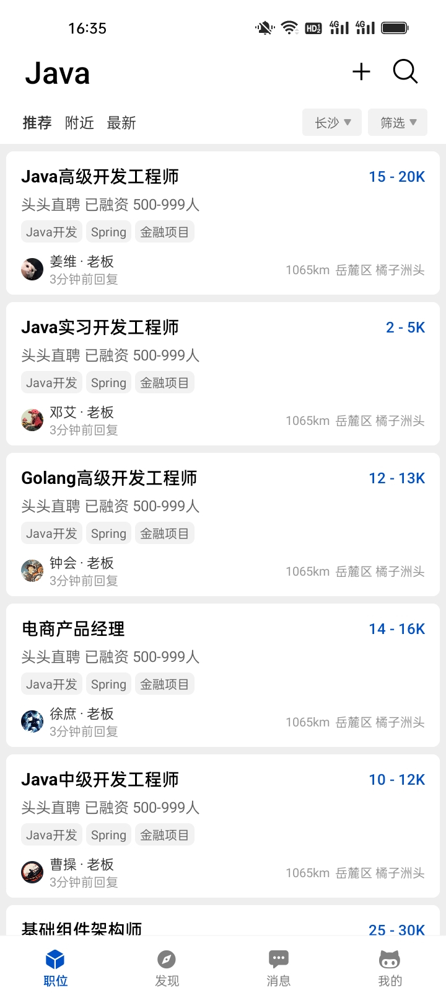
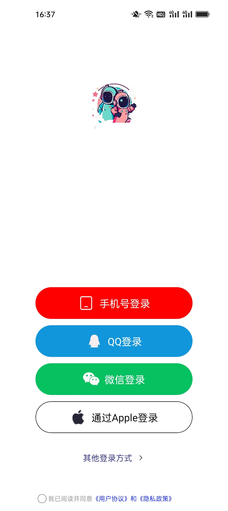

# tt-zhipin

## 项目介绍

头头直聘，仿Boss直聘实现。SpringBoot3 + Java17 + SpringCloud Alibaba 构建后端，React Native 构建移动端，Vue3.0 + Arco Design 构建管理后台，Hadoop + Flink 实现大数据体系。实现招聘、内容管理、IM即时通讯等业务。

## 架构预览

## 项目特点

* 技术全面：提供多种技术栈，移动端、PC 端、后端皆有支持，且每种技术都是当前较新技术。
* 方案通用：封装的 starter，代码规范，DDD 领域驱动设计，RBAC 权限管理，各种封装的组件可以灵活运用到其他项目中。
* 代码复用：管理后台封装 BaseController，一次继承解决基础增删改查。
* 版本管理：通过 Liquibase 管理数据库版本，跟踪、管理和应用数据库变化。
* 数仓支持：提供 Hadoop 技术栈支持，通过 CDH 构建，实现离线数仓与实时数仓。
* 扩展方案：多种分库分表策略，高并发场景。
* 持续集成：实现 DevOps，通过 DroneCI/Jenkins 实现部署的全流程自动化
* 容器编排：通过 Rancher/DockerSwarm 实现多容器的部署、管理与监控。
* 系统监控：通过 ELK 实现日志监控，通过 SkyWalking 实现链路追踪，通过 Prometheus + Grafana 实现系统监控。
* 其他：待补充

## APP 截图预览

|                                                           |                                                           |                                                           |  |  
| :--: | :--: | :--: | :--: |  
| 首页列表 | 职位详情 | 职位详情 | 聊天列表 |  

|                                                           |                                                           |                                                           |  |  
|     :--:    |     :--:     |     :--:  |   :--:        |  
| 聊天详情 | 聊天详情 | 个人界面  |   在线简历 |  

|                                                         |                                                         |                                                         |  |  
|     :--:    |     :--:     |     :--:  |   :--:        |  
| 附件简历 | 切换身份 | 登录界面  |   手机登录 |  

## 快速启动
//TODO

### 后端
//TODO

### 前端
//TODO